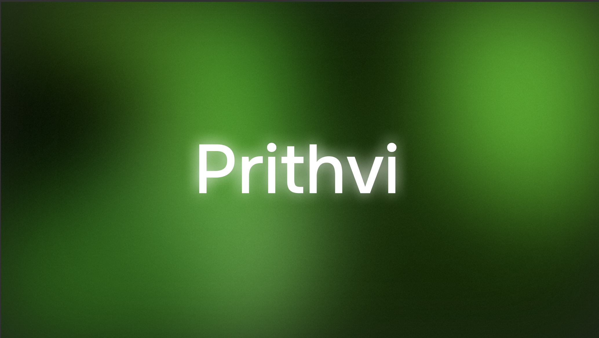

# Prithvi: A Key-Value Database



**Prithvi** is an in-memory `key-value database` built from scratch in Java, without relying on external frameworks. It provides basic data storage operations, persistence to disk, and essential features like TTL (Time-To-Live) expiry and automatic data management.

## Contents

- [Prithvi: A Key-Value Database](#prithvi-a-key-value-database)
  - [Contents](#contents)
    - [Benchmarking vs Redis](#benchmarking-vs-redis)
      - [Tech Stack](#tech-stack)
  - [Contents](#contents-1)
  - [Features](#features)
  - [Getting Started](#getting-started)
    - [Prerequisites](#prerequisites)
    - [Running the Server](#running-the-server)
      - [Normal](#normal)
      - [Using Docker](#using-docker)
  - [Commands](#commands)
  - [Persistence](#persistence)
  - [Architecture \& Design Notes](#architecture--design-notes)
  - [Client SDKs](#client-sdks)
    - [Metrics and Monitoring](#metrics-and-monitoring)
    - [Write-Ahead Logging (WAL)](#write-ahead-logging-wal)
    - [Version](#version)
  - [Security Warning](#security-warning)
  - [Contributing](#contributing)
  - [License](#license)
  - [Author](#author)

---

### Benchmarking vs Redis

We benchmarked Prithvi against Redis (v7.2) on the same machine using a custom load generator simulating `SET`/`GET` operations with random keys.


| Metric             | Redis      | Prithvi    |
| ------------------ | ---------- | ---------- |
| Peak TPS (SET+GET) | 169k ops/s | 138k ops/s |
| Avg Latency (GET)  | 0.61       | 0.72       |
| Min Latency (ms)   | 0.02       | 0.03       |
| Max Latency (ms)   | 627        | 38         |

> Tested locally on MacBook M1 Air (16 GB RAM) with a custom Java load generator using 100 threads, 100k ops (SET+GET).

> Redis ran with default config (no AOF, no snapshotting); <

> Prithvi ran with WAL enabled, TTL/AutoSave off.

**Note**: Prithvi is NOT ⚠️ optimized with native code or memory pooling like Redis, but performs **strongly** for educational use-cases and mid-scale deployments.

---

#### Tech Stack

[](https://skillicons.dev)

## Contents

- [Prithvi: A Key-Value Database](#prithvi-a-key-value-database)
  - [Contents](#contents)
    - [Benchmarking vs Redis](#benchmarking-vs-redis)
      - [Tech Stack](#tech-stack)
  - [Contents](#contents-1)
  - [Features](#features)
  - [Getting Started](#getting-started)
    - [Prerequisites](#prerequisites)
    - [Running the Server](#running-the-server)
      - [Normal](#normal)
      - [Using Docker](#using-docker)
  - [Commands](#commands)
  - [Persistence](#persistence)
  - [Architecture \& Design Notes](#architecture--design-notes)
  - [Client SDKs](#client-sdks)
    - [Metrics and Monitoring](#metrics-and-monitoring)
    - [Write-Ahead Logging (WAL)](#write-ahead-logging-wal)
    - [Version](#version)
  - [Security Warning](#security-warning)
  - [Contributing](#contributing)
  - [License](#license)
  - [Author](#author)

---

## Features

Prithvi offers a core set of functionalities for a lightweight key-value database:

- **In-Memory Key-Value Storage**: Pure Java implementation for efficient in-memory data handling.
- **Data Types**: Supports string values for keys, and also includes basic list (deque) operations.
- **Time-To-Live (TTL) Expiry**: Keys can be set with an expiration time, after which they are automatically removed.
- **LRU Cache**: Maintains a `MAX_CAPACITY` of 10,000 keys and uses `LinkedHashMap` to evict elderly keys after threshold is reached. Load Factor is 0.75f.
- **Persistence to Disk**: Stores data to a JSON-based file (`data/store.json`) allowing data to survive server restarts.
- **Auto-Save & Auto-Load**: Configurable periodic saving of the store to disk and automatic loading on server startup.
- **Automatic Expired Key Removal**: A background task periodically cleans up expired keys.
- **Multi-threaded Client Handling**: Each client connection is handled in a separate thread for concurrent access.
- **Graceful Shutdown**: Implements a shutdown hook to ensure data is saved to disk when the server is terminated (e.g., via Ctrl+C).

---

## Getting Started

These instructions will get you a copy of the project up and running on your local machine for development and testing purposes.

### Prerequisites

- Java Development Kit (JDK) 11 or newer.

### Running the Server

#### Normal

1. **Clone the repository:**

   ```bash
   git clone https://github.com/psidh/Prithvi
   cd Prithvi
   ```

2. **Compile and run the server:**

   ```bash
   chmod +x run.sh
   ./run.sh
   ```

   The server will start and listen on port `1902`. You will see startup information and the Prithvi ASCII art logo in your console.

---

#### Using Docker

```bash
docker pull psidharth/prithvi-docker
```

---

## Commands

Once the server is running, you can connect to it using a client (e.g., `nc` or a simple TCP client program) on port `1902` and issue the following commands:

| Command Syntax                   | Description                                                           |
| :------------------------------- | :-------------------------------------------------------------------- |
| `SET <key> <value>`              | Stores a string `value` associated with `key`.                        |
| `SET <key> <value> EX <seconds>` | Stores `value` with `key` that expires after `<seconds>`.             |
| `GET <key>`                      | Retrieves the `value` and its expiry information for `key`.           |
| `DEL <key>`                      | Deletes the specified `key` from the store.                           |
| `EXISTS <key>`                   | Checks if `key` exists in the store.                                  |
| `SADD <key> <value>`             | Adds `value` to a Set identified by `key`. Creates new Set if needed. |
| `SMEMBERS <key>`                 | Lists all members of the Set stored at `key`.                         |
| `SREM <key> <value>`             | Removes `value` from the Set identified by `key`.                     |
| `LPUSH <key> <value>`            | Pushes `value` onto the left end of a list identified by `key`.       |
| `RPUSH <key> <value>`            | Pushes `value` onto the right end of a list identified by `key`.      |
| `LPOP <key>`                     | Removes and returns the element from the left end of a list.          |
| `RPOP <key>`                     | Removes and returns the element from the right end of a list.         |
| `GETLIST <key>`                  | Displays all elements in the list associated with `key`.              |
| `KEYS`                           | Lists all keys currently in the store with their expiry.              |
| `FLUSH`                          | Clears all keys from the store, requires confirmation.                |
| `FLUSH FALL`                     | Clears all keys from the store without confirmation.                  |
| `SAVE`                           | Explicitly persists the current state of the store to disk.           |
| `LOAD`                           | Loads the store state from disk, overwriting current in-memory data.  |
| `AUTH <username>`                | Authenticates the user and returns a JWT token.                       |
| `TOKEN <jwt>`                    | Sets the token for the current session for further verification.      |
| `QUIT`                           | Gracefully closes the client connection.                              |
| `HELP`                           | Displays a quick reference of all available commands.                 |

---

## Persistence

Prithvi's persistence mechanism saves the in-memory state to `data/store.json`.

- **AutoSave**: By default, the server performs a periodic auto-save (e.g., every 300 seconds as configured in `Prithvi.java`).
- **AutoLoad**: On startup, Prithvi attempts to load the last saved state from `data/store.json`.
- **Manual Save/Load**: You can manually trigger saves with the `SAVE` command and loads with the `LOAD` command.
- **Shutdown Hook**: Ensures data is saved upon a graceful shutdown (e.g., Ctrl+C).

---

## Architecture & Design Notes

- **No Frameworks**: The project is intentionally built using pure Java APIs to demonstrate fundamental concepts of network programming, concurrency, and data structures.
- **`Map`**: Used as the primary data store to ensure thread-safe operations across multiple client connections.
- **Background Tasks**: Two dedicated threads manage key expiry and auto-saving, keeping the main server loop responsive.

<br />

---

## Client SDKs

A lightweight JavaScript/Python Client SDK is available to interact with Prithvi from browsers or Node.js.

It wraps the custom TCP protocol and exposes async `set`, `get`, `del`, `auth`, and other command helpers.  
🔗 [Prithvi JS SDK](https://github.com/psidh/prithvi-js-sdk)
🔗 [Prithvi Python SDK](https://github.com/psidh/prithvi-py-sdk)

---

### Metrics and Monitoring

- **Built-in Metrics Dashboard**: Prithvi now exposes an endpoint on **port `9100`** that serves real-time internal metrics in [Prometheus-compatible format](https://prometheus.io/docs/instrumenting/exposition_formats/).

- **Monitored Stats Include**:

  - Total Requests
  - Total Reads
  - Total Writes
  - Total Errors
  - Average Latency

- **How to Use**:

  - Add the following scrape config to your Prometheus YAML:

    ```yaml
    scrape_configs:
      - job_name: "prithvi"
        static_configs:
          - targets: ["localhost:9100"]
    ```

---

### Write-Ahead Logging (WAL)

To ensure **durability and crash recovery**, Prithvi uses a WAL system.

- **WALManager**: Logs every mutating command (`SET`, `DEL`, `SADD`, etc.) to `logs/wal.log`.
- **WALReplayer**: On startup, Prithvi replays the WAL file to reconstruct the exact state prior to crash or shutdown.
- **How it Works**:

  - WAL is **append-only**
  - WAL is flushed **before** applying command in memory (write-ahead principle)
  - On restart, Prithvi checks `wal.log` → replays all valid entries → then loads `store.json`

This makes **persistence + recovery reliable**, even if shutdown was ungraceful.

---

### Version

Current Release: v0.1.0-alpha.1
Released on: `July 21, 2025`

> Prithvi is currently in alpha — breaking changes may occur. Use for educational or experimental purposes.

---

## Security Warning

**⚠️ Warning**: This is an experimental build and is not intended for production use. It consists of basic authentication, encryption, but lacks robust error handling typical of production-grade systems. Use with caution.

---

## Contributing

Checkout [Contributing.md](./CONTRIBUTING.md)

---

## License

This project is licensed under the [Apache 2.0 License](LICENSE)

---

## Author

- **Philkhana Sidharth**
